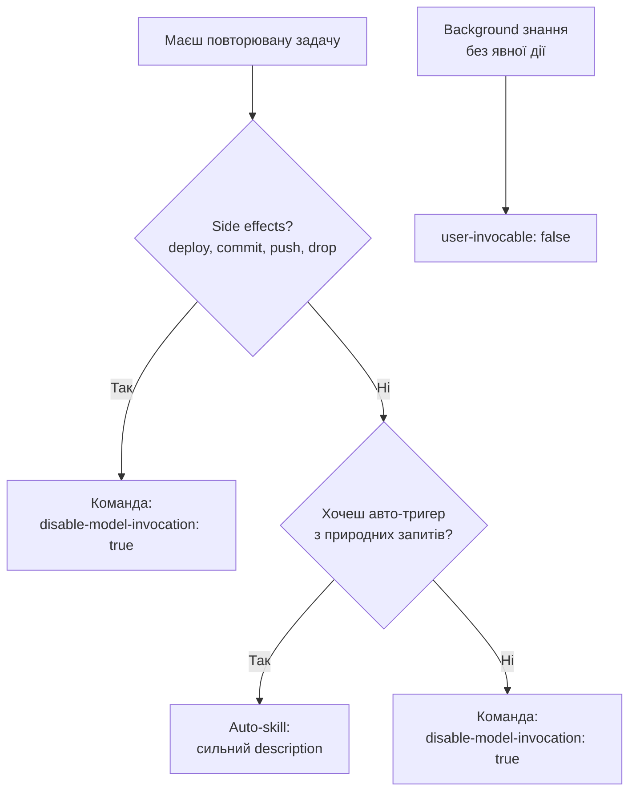

# Workshop 03

## Slash Commands: глибше

<div class="text-sm opacity-60 mt-12">90 хв · 4 вправи · `exercises/` репо паралельно</div>

<!--
Третій воркшоп серії. У fundamentals ти бачив що `/`-команди є — сьогодні пишемо їх з нуля з аргументами, shell-ін'єкцією, namespacing у плагіні. Тримай терміналом.
-->

---
transition: fade-out
hideInToc: true
---

# Що ти зможеш після

<v-clicks>

- **Написати `/команду`** — з frontmatter, аргументами, shell-ін'єкцією
- **Розрізнити команду vs auto-skill** — коли `disable-model-invocation: true`
- **Знати чим `allowed-tools` НЕ є** — pre-approval, не sandbox
- **Запакувати команди у плагін** з namespaced invocation `/plugin:name`
- **Мігрувати** з legacy `.claude/commands/foo.md` → `.claude/skills/foo/SKILL.md`

</v-clicks>

<!--
Після воркшопу — два робочі плагіни на твоєму диску, плюс розуміння чому slash-команди тепер — це skills.
-->

---
hideInToc: true
---

# Як працюватимемо

<v-clicks>

- **Я веду** — слайди + live-demo
- **Ти кодиш паралельно** — `git clone <repo>; cd workshops/03-slash-commands/exercises`
- **4 вправи** — кожна 10–15 хв, у власній підтеці
- **`solutions/`** — готові розв'язки на випадок, якщо застрягнеш
- **`handout.pdf`** — пост-воркшоп референс

</v-clicks>

<div v-click class="mt-4 p-4 bg-blue-500/10 rounded text-sm">
Передумови: Claude Code v1.x, термінал, доступ до <code>~/.claude/</code>, git-репо для тестів
</div>

<!--
Хвилину на клон. Хто не встиг — пиши в чат.
-->

---
layout: section
---

# Контекст

Slash-команди тепер — це skills

---

# The big merge

<v-clicks>

- Раніше: `.claude/commands/deploy.md` — окремий формат
- Тепер: `.claude/skills/deploy/SKILL.md` — той самий результат `/deploy`
- **Frontmatter — той самий schema**, що й у skills (workshop 04)
- Старі `.claude/commands/*.md` **далі працюють** (backward compat)
- Нові — пишемо як skills: підтримка `references/`, `scripts/`, `disable-model-invocation`

</v-clicks>

<v-click class="mt-3 p-3 bg-amber-500/10 rounded text-sm">

Якщо у тебе є і `commands/deploy.md`, і `skills/deploy/SKILL.md` — **skill виграє**.

</v-click>

<DocRef url="https://code.claude.com/docs/en/skills" label="code.claude.com — Commands merged into skills" />

<!--
Це найважливіший меседж. Все що ти знаєш про skills (workshop 04) — застосовується. Тут ми фокусуємось на explicit-trigger частині цього спільного формату.
-->

---

# Команда vs auto-skill — одна різниця

```yaml {all|3}{lines:true}
---
name: deploy
description: Deploy to production
disable-model-invocation: true   # ← це робить її командою
---
Deploy $ARGUMENTS to production:
1. Run tests
2. Build
3. Push
```

<v-clicks>

| `disable-model-invocation` | Тригер | Use case |
|---|---|---|
| `false` (default) | `/deploy` АБО Claude сам | Безпечні задачі, де авто-тригер допомагає |
| `true` | Тільки `/deploy` від тебе | Side effects: deploy, commit, drop DB |

</v-clicks>

<v-click class="mt-2 text-sm opacity-70">

Слово «команда» у Claude Code = «skill з `disable-model-invocation: true`».

</v-click>

<DocRef url="https://code.claude.com/docs/en/skills#control-who-invokes-a-skill" label="code.claude.com — Invocation control" />

<!--
Це ключова відмінність workshop 03 від 04. У 04 ми будували authority через description — щоб Claude САМ викликав. Тут — навпаки: явно блокуємо авто-інвокацію.
-->

---

# Decision tree: команда чи skill?



<v-click>

**Правило великого пальця:** будь-що з side effects → команда. Інакше — за смаком.

</v-click>

<!--
Не намагайся зробити `/deploy` авто-тригером. Це питання часу, коли Claude вирішить що «код виглядає готовим», і запушить production.
-->

---
layout: section
---

# Anatomy

Що всередині `SKILL.md` для команди

---

# Frontmatter: командний мінімум

```yaml {all|2|3|4|5|6}{lines:true}
---
name: git-summary
description: Summarize recent git commits
argument-hint: [--since=<duration>] [--author=<name>]
disable-model-invocation: true
allowed-tools: Bash(git log *)
---
```

<v-clicks>

- **`name`** — стає `/name`. kebab-case, ≤64 символів
- **`description`** — текст у `/`-меню. У командах менш критично за skills (тригер вже явний)
- **`argument-hint`** — підказка автокомпліту: `[--since=<duration>]`
- **`disable-model-invocation: true`** — робить це **командою**, не auto-skill
- **`allowed-tools`** — пре-апрув. Що Claude може без prompt-у

</v-clicks>

<DocRef url="https://code.claude.com/docs/en/skills#frontmatter-reference" label="code.claude.com — Frontmatter reference" />

<!--
П'ять полів — все що треба для 90% команд. Решту розглянемо за потреби.
-->

---

# `$ARGUMENTS`: чотири способи

```yaml
---
name: migrate-component
description: Migrate component from one framework to another
arguments: [name, from, to]
---
```

<v-clicks>

| Синтаксис | Значення | Приклад при `/migrate-component SearchBar React Vue` |
|---|---|---|
| `$ARGUMENTS` | Все одним рядком | `SearchBar React Vue` |
| `$ARGUMENTS[0]` | За індексом | `SearchBar` |
| `$0`, `$1`, `$2` | Шорткат | `SearchBar`, `React`, `Vue` |
| `$name`, `$from`, `$to` | За іменами з `arguments:` | те саме |

</v-clicks>

<v-click class="mt-2 text-sm opacity-70">

**Лапки = один токен:** `/migrate "hello world" Vue` → `$0 = "hello world"`, `$1 = "Vue"`.

</v-click>

<DocRef url="https://code.claude.com/docs/en/skills#available-string-substitutions" label="code.claude.com — String substitutions" />

<!--
Чотири синтакси на один кейс. Я ставлю `$ARGUMENTS` для гнучкості, або `$0/$1` для строгого формату. Іменовані використовую коли SKILL.md довгий і хочеться читабельності.
-->

---

# Якщо забув `$ARGUMENTS`

```yaml
---
name: lazy-skill
description: Does something
---
Do the thing.
```

```text
/lazy-skill foo bar
```

<v-clicks>

Що Claude бачить:

```text
Do the thing.

ARGUMENTS: foo bar
```

- Якщо плейсхолдера немає — Claude Code **сам додає** `ARGUMENTS: <value>` у кінець
- Зручно для прототипу, але краще писати `$ARGUMENTS` явно

</v-clicks>

<DocRef url="https://code.claude.com/docs/en/skills#pass-arguments-to-skills" label="code.claude.com — Pass arguments" />

<!--
Це дефолтна fallback-поведінка. Я її не використовую у production — занадто implicit. Але знати треба.
-->

---

# Вправа 1 — `/git-summary` з `$ARGUMENTS`

**Мета:** робоча команда з аргументами

```bash
cd workshops/03-slash-commands/exercises/01-git-summary
cat README.md
```

<v-clicks>

**Кроки:**

1. `mkdir -p ~/.claude/skills/git-summary`
2. Скопіюй стартер, допиши frontmatter (`argument-hint`, `disable-model-invocation`)
3. Тіло — використовує `$ARGUMENTS`
4. Тестуй:
   - `/git-summary`
   - `/git-summary --since=yesterday`
   - `/git-summary --author=vadym --since="1 week ago"`

</v-clicks>

<v-click class="mt-2 text-sm opacity-70">

Час: 10 хв. `solutions/01-git-summary/SKILL.md` — готове.

</v-click>

<!--
Перевір що `/`-меню показує підказку аргументів — це знак що `argument-hint` зчитався. Якщо нема — типовий факап у frontmatter.
-->

---
layout: section
---

# Динамічний контекст

Shell-ін'єкція через `!`команда``

---

# Без ін'єкції: 4 turn-и

```text
> /env-info
[Claude] Sure, let me gather context.
[Claude → Bash] pwd
[Claude] Working dir is /tmp/foo
[Claude → Bash] git branch --show-current
[Claude] Branch is feat/x
[Claude → Bash] git log -1 --oneline
[Claude] Latest is abc123 init
[Claude] Summary: ...
```

<v-clicks>

- **Чотири** tool-call-и
- Кожен — round-trip до моделі
- Час + токени + лімі бюджет

</v-clicks>

<!--
Це baseline. Команда без ін'єкції просить Claude самостійно зібрати контекст — повільно і дорого.
-->

---

# З ін'єкцією: 1 turn

```yaml
---
name: env-info
allowed-tools: Bash(pwd) Bash(git *)
---

## Context
- Working dir: !`pwd`
- Branch: !`git branch --show-current`
- Latest: !`git log -1 --oneline`

## Task
Summarise environment, flag anomalies.
```

<v-clicks>

- `!`команда`` виконується **до того, як Claude побачить промпт**
- Вивід підставляється у тіло
- Claude отримує **готові дані** — один turn

</v-clicks>

<DocRef url="https://code.claude.com/docs/en/skills#inject-dynamic-context" label="code.claude.com — Inject dynamic context" />

<!--
Це preprocessing, а не виконання Claude. Ключове розуміння. Claude не «знає» що там був shell-call — для нього це просто текст у промпті.
-->

---

# Multi-line: ` ```! ` block

````markdown
## Environment
```!
node --version
npm --version
git status --short
```
````

<v-clicks>

- Inline `!`cmd`` — для одного рядка
- Fenced ` ```! ... ``` ` — для кількох команд
- Вивід усього блоку (stdout) підставляється у промпт

</v-clicks>

<v-click class="mt-2 p-3 bg-blue-500/10 rounded text-sm">

`shell: bash` (default) або `shell: powershell` у frontmatter — для Windows.

</v-click>

<DocRef url="https://code.claude.com/docs/en/skills#inject-dynamic-context" label="code.claude.com — Multi-line shell" />

<!--
Fenced варіант зручний коли треба зібрати кілька рядків діагностики разом. Не зловживай — все одно це токени, які займають місце.
-->

---

# Pitfall: `disableSkillShellExecution`

```json
// ~/.claude/settings.json
{
  "disableSkillShellExecution": true
}
```

<v-clicks>

- Корпоративна security-фіча
- Кожен `!`cmd`` замінюється на `[shell command execution disabled by policy]`
- Працює для skills та custom commands
- **Не зачіпає** bundled skills (`/debug`, `/loop` тощо) і managed skills

</v-clicks>

<v-click class="mt-3 p-3 bg-amber-500/10 rounded text-sm">

⚠️ Якщо `!`команда`` повертає placeholder — перевір settings перш ніж дебажити skill.

</v-click>

<DocRef url="https://code.claude.com/docs/en/skills#inject-dynamic-context" label="code.claude.com — Disable shell execution" />

<!--
У managed settings (enterprise) користувач не зможе оверайдити. Корисно знати що цей kill-switch існує.
-->

---

# Вправа 2 — динамічний контекст

**Мета:** додати в `/env-info` ін'єкції

```bash
cd ../02-shell-injection
ls
```

<v-clicks>

**Кроки:**
1. Скопіюй стартер у `~/.claude/skills/env-info/`
2. Заміни `TODO` на `!`команда``: `pwd`, `git branch --show-current`, `git log -1 --oneline`, `node --version`
3. Додай fenced ` ```! ` блок з `uname -a`
4. Виклич `/env-info`
5. **Експеримент:** додай fail-команду (`!`nonexistent``). Що бачить Claude?

</v-clicks>

<v-click class="mt-2 text-sm opacity-70">

Час: 10 хв. `solutions/02-shell-injection/SKILL.md` — готове.

</v-click>

<!--
Очікуваний результат — bash повертає stderr та exit code, вивід підставляється як є. Claude бачить помилку як текст і коментує.
-->

---
layout: section
---

# `allowed-tools`

Pre-approval — НЕ sandbox

---

# `allowed-tools`: що це таке

```yaml
---
name: commit
disable-model-invocation: true
allowed-tools: Bash(git add *) Bash(git commit *) Bash(git status *)
---
```

<v-clicks>

- **Дозволяє** Claude використовувати ці tool-и **без prompt-у про апрув**
- **Не обмежує** доступні tool-и — інші просто потребуватимуть апруву
- Permission settings далі діють (deny rules перебивають)
- Pattern: `ToolName(matcher)` — `Bash(npm *)`, `Bash(git add *)`
- Space-separated string АБО YAML list

</v-clicks>

<DocRef url="https://code.claude.com/docs/en/skills#pre-approve-tools-for-a-skill" label="code.claude.com — Pre-approve tools" />

<!--
Найчастіше непорозуміння. `allowed-tools` — це білий список бескавоугольний для approval prompt-ів. Не sandbox.
-->

---

# Що `allowed-tools` НЕ робить

<v-clicks>

❌ **Не блокує** інші tool-и — вони далі викликаються через approval prompt
❌ **Не ізолює** від файлової системи — Read/Write/Edit працюють як завжди
❌ **Не зупиняє** Claude робити те, що ти не хотів — лише прискорює дозволене

</v-clicks>

<v-click class="mt-3 p-3 bg-rose-500/10 rounded text-sm">

**Цитата docs:** *"It does not restrict which tools are available: every tool remains callable, and your permission settings still govern tools that are not listed."*

</v-click>

<v-click>

Щоб **заборонити** — потрібні **deny-rules** у `~/.claude/settings.json`:

```json
{
  "permissions": {
    "deny": ["Bash(rm *)", "Bash(curl *)"]
  }
}
```

</v-click>

<DocRef url="https://code.claude.com/docs/en/skills#restrict-claudes-skill-access" label="code.claude.com — Restrict access" />

<!--
Якщо чуєш "обмеж скрипт лише git-командами" — потрібен дует: allowed-tools (для UX) + deny-rules (для безпеки). Це різні шари.
-->

---

# Sandbox profile через settings

```json {all|3-9|10-15}{lines:true}
{
  "permissions": {
    "allow": [
      "Bash(git status *)",
      "Bash(git log *)",
      "Bash(git diff *)",
      "Bash(git branch *)",
      "Bash(git stash list *)"
    ],
    "deny": [
      "Bash(git push *)",
      "Bash(git reset *)",
      "Bash(rm *)",
      "Bash(curl *)"
    ]
  }
}
```

<v-clicks>

- **`allow`** — пре-апрув на global рівні (не лише в скіллі)
- **`deny`** — справжній бан, перебиває все
- Combo з `allowed-tools` у SKILL.md = щільний контроль

</v-clicks>

<DocRef url="https://code.claude.com/docs/en/permissions" label="code.claude.com — Permissions" />

<!--
Якщо команда стосується чогось чутливого — вкладай дві лінії оборони. SKILL.md описує що команда вміє, settings блокує що НЕ вміє.
-->

---

# Вправа 3 — `allowed-tools` на практиці

**Мета:** написати `/git-cleanup`, що проходить без жодного approval-prompt

```bash
cd ../03-allowed-tools
```

<v-clicks>

**Кроки:**
1. Стартер — заготовка з порожнім `allowed-tools:`
2. Заповни так, щоб без promp-у проходили: `git status`, `git stash list`, `git branch -l`, `git log --oneline`
3. Тіло — звіт по 4 секціях
4. Виклич — має пройти 0 prompt-ів
5. Спробуй модифікацію тіла на `rm -rf /tmp/x` — що сталось?
6. **Бонус:** додай deny-rules у settings — справжній sandbox

</v-clicks>

<v-click class="mt-2 text-sm opacity-70">

Час: 15 хв. `solutions/03-allowed-tools/` — SKILL.md + `settings-snippet.json`.

</v-click>

<!--
Бонус-частина — найкорисніша. Sandbox profile у settings — це те, що варто мати під рукою для всіх ризикових команд.
-->

---
layout: section
---

# Plugins

Namespacing і дистрибуція

---

# Project skill vs plugin

| Спосіб | Локація | Інвокація | Кому |
|---|---|---|---|
| **Personal** | `~/.claude/skills/foo/SKILL.md` | `/foo` | Тільки тобі |
| **Project** | `.claude/skills/foo/SKILL.md` (commit) | `/foo` | Команді |
| **Plugin** | `<plugin>/skills/foo/SKILL.md` | `/plugin:foo` | Усім |

<v-clicks>

- Plugin namespacing з префіксу — **не плутаються** імена між плагінами
- Personal перебиває project; project не перебиває personal (різні неймспейси з плагінами)
- Plugin завжди розв'язується через свій namespace

</v-clicks>

<DocRef url="https://code.claude.com/docs/en/plugins#when-to-use-plugins-vs-standalone-configuration" label="code.claude.com — When plugin vs standalone" />

<!--
Personal — швидкий прототип. Project — командний commit. Plugin — ширше: версіонування, marketplace.
-->

---

# `plugin.json` — мінімум

```json
{
  "name": "my-git-commands",
  "description": "Git workflow commands: log summary, env info",
  "version": "0.1.0",
  "author": {
    "name": "Vadym Bondarenko"
  }
}
```

<v-clicks>

- **`name`** — обов'язково. Стає префіксом неймспейса (`/my-git-commands:foo`)
- **`version`** — опційно. Якщо нема — commit SHA. **Set explicit** для semver
- **`description`, `author`** — для marketplace UI
- Файл лежить у `<plugin>/.claude-plugin/plugin.json` — і **тільки** він всередині `.claude-plugin/`

</v-clicks>

<DocRef url="https://code.claude.com/docs/en/plugins#create-your-first-plugin" label="code.claude.com — Plugin manifest" />

<!--
Якщо змініш `name` — змінився namespace, юзери будуть бачити нові команди (старі — як неробочі). Ребрендинг плагіна = міграція.
-->

---

# Структура плагіна

```text {all|3|4-6}{lines:true}
my-git-commands/
├── .claude-plugin/
│   └── plugin.json          ← маніфест (тільки він тут)
└── skills/
    ├── git-summary/
    │   └── SKILL.md
    └── env-info/
        └── SKILL.md
```

<v-clicks>

- `skills/` — на рівні root плагіна, **НЕ** всередині `.claude-plugin/`
- Один `SKILL.md` на тек/команду
- Можна додати `agents/`, `hooks/`, `commands/` (legacy), `bin/`, `.mcp.json` — теж на root рівні

</v-clicks>

<v-click class="mt-2 p-3 bg-rose-500/10 rounded text-sm">

⚠️ **Найчастіший факап:** `skills/` всередині `.claude-plugin/`. Не працює.

</v-click>

<DocRef url="https://code.claude.com/docs/en/plugins#plugin-structure-overview" label="code.claude.com — Plugin structure" />

<!--
Документація прямо warning-ом на це попереджає. Перевір структуру до першого `--plugin-dir` запуску.
-->

---

# Локальне тестування — `--plugin-dir`

```bash
claude --plugin-dir ./my-git-commands
```

<v-clicks>

- Завантажує плагін **без встановлення**
- Перебиває одноіменний marketplace-плагін на цю сесію (зручно для dev)
- Можна декілька прапорців: `--plugin-dir ./p1 --plugin-dir ./p2`
- Edit-and-reload: `/reload-plugins` — підхопить зміни SKILL.md без рестарту

</v-clicks>

<v-click class="mt-2 text-sm opacity-70">

Створив **нову теку** skill-а у плагіні → `/reload-plugins` зчитає. Створив **новий плагін** → потрібен рестарт Claude Code.

</v-click>

<DocRef url="https://code.claude.com/docs/en/plugins#test-your-plugins-locally" label="code.claude.com — --plugin-dir" />

<!--
Це твій основний dev loop. Ніяких install/uninstall — просто запускаєш Claude з шляхом до теки.
-->

---

# Вправа 4 — пакуємо у плагін

**Мета:** дві команди → плагін з namespaced invocation

```bash
cd ../04-plugin-pack
ls starter/
```

<v-clicks>

**Кроки:**
1. `mkdir -p my-git-commands/.claude-plugin`
2. `cp -r starter/skills my-git-commands/skills`
3. Напиши `my-git-commands/.claude-plugin/plugin.json`
4. `claude --plugin-dir ./my-git-commands`
5. Перевір `/`-меню: `/my-git-commands:git-summary`, `/my-git-commands:env-info`
6. Виклич з аргументами: `/my-git-commands:git-summary --since=yesterday`

</v-clicks>

<v-click class="mt-2 text-sm opacity-70">

Час: 15 хв. `solutions/04-plugin-pack/my-git-commands/` — повна структура.

</v-click>

<!--
Після цього у тебе свій плагін. Бонус — додати GitHub repo, потім marketplace через /plugin форму.
-->

---
layout: section
---

# Debug

Команда не працює. Що першим перевірити.

---

# Команда не з'являється у `/`-меню: 5 кроків

<v-clicks>

1. **Шлях точний?**
   ```bash
   ls ~/.claude/skills/<name>/SKILL.md   # personal
   ls .claude/skills/<name>/SKILL.md     # project
   ```

2. **Frontmatter валідний YAML?** `---` зверху і знизу, відступи пробілами

3. **`name` лежить у дозволених символах?** kebab-case, цифри, дефіси, ≤64

4. **Створював **нову теку** під час сесії?** Потрібен рестарт Claude Code

5. **Плагін?** `--plugin-dir` був переданий? `/reload-plugins` після edit?

</v-clicks>

<DocRef url="https://code.claude.com/docs/en/skills#troubleshooting" label="code.claude.com — Troubleshooting" />

<!--
90% — кроки 1–2. Решта 10% — частіше за все плагіни і їх живий цикл.
-->

---

# `$ARGUMENTS` не підставляється

<v-clicks>

- **Перевір** що використовуєш точний синтаксис: `$ARGUMENTS`, `$0`, `$ARGUMENTS[0]`, `$name`
- **Не плутай з shell:** в bash це інше. Тут це plain-text substitution
- **`arguments:` поле для іменованих** обов'язкове, інакше `$name` не працює:

  ```yaml
  arguments: [issue, branch]
  ```
  → доступні `$issue`, `$branch`

- **Лапки = один токен:** `/cmd "hello world"` → `$0 = hello world`
- **Без плейсхолдера** — додається `ARGUMENTS: <text>` у кінець SKILL.md (fallback)

</v-clicks>

<DocRef url="https://code.claude.com/docs/en/skills#available-string-substitutions" label="code.claude.com — Substitutions" />

<!--
Якщо `$ARGUMENTS` лишається у виводі як literal — отже substitution не відбулось. Перевір frontmatter, можливо проблема у YAML парсингу.
-->

---

# `!`cmd`` повертає placeholder

```text
[shell command execution disabled by policy]
```

<v-clicks>

**Причини:**

- `"disableSkillShellExecution": true` у settings (твоїх або managed)
- Корпоративна політика заблокувала
- **Не торкається:** bundled (`/debug`, `/loop`) і managed skills

**Перевір:**
```bash
grep -r disableSkillShellExecution ~/.claude/settings.json /etc/claude-code/managed-settings.json
```

</v-clicks>

<DocRef url="https://code.claude.com/docs/en/skills#inject-dynamic-context" label="code.claude.com — Disable shell execution" />

<!--
Якщо ти на корпоративному ноуті — є шанс що IT-департамент заблокував через managed settings. Це override якого ти не побачиш у власному settings.json.
-->

---

# Description обрізається

<v-clicks>

- Бюджет описів — **1% контекстного вікна** (default ~8K символів)
- Багато skill-ів + довгі description → обрізаються
- Кожен `description + when_to_use` сам по собі ≤ 1536 символів
- **Підняти ліміт:**
  ```bash
  export SLASH_COMMAND_TOOL_CHAR_BUDGET=16000
  ```

</v-clicks>

<v-click class="mt-3 p-3 bg-blue-500/10 rounded text-sm">

Для **команд** (явний trigger) це менш критично, ніж для auto-skills. Description у командах — це UX `/`-меню, не trigger.

</v-click>

<DocRef url="https://code.claude.com/docs/en/skills#skill-descriptions-are-cut-short" label="code.claude.com — Description budget" />

<!--
Для slash-команд description — це підпис у меню. Тримай коротко: 1 речення, основне у перших 80 символах.
-->

---
layout: section
---

# Production-готовність

---

# Чек-ліст перед публікацією

<v-clicks>

- [ ] **`name`** — kebab-case, унікальний у твоєму неймспейсі
- [ ] **`description`** — однорядкова, корисна у `/`-меню
- [ ] **`argument-hint`** для команд з аргументами
- [ ] **`disable-model-invocation: true`** для всього з side effects
- [ ] **`allowed-tools`** — пре-апрув **лише** потрібного
- [ ] **`!`cmd``** — лише там, де економія турнів реально варта
- [ ] **Deny-rules** у settings.json для справжньої ізоляції
- [ ] **Тестовано** на чистій сесії (порожній репо, нема node, тощо)
- [ ] **Plugin?** `version` у `plugin.json` для semver
- [ ] **README.md** у плагіні: як встановити, що робить

</v-clicks>

<!--
Якщо хоча б один пункт не виконано — не публікуй. Особливо deny-rules — вони основа security.
-->

---

# Розподіл: 3 шляхи

| Спосіб | Коли | Setup |
|---|---|---|
| **Personal** | Прототип, ще не зрів | Скопіювати у `~/.claude/skills/` |
| **Project** | Командний workflow, шейринг через git | Commit `.claude/skills/` у репо |
| **Plugin** | Marketplace, semver, namespace | `plugin.json` + git repo + (опційно) marketplace |

<v-clicks>

**Прогрес зрілості:** Personal → Project → Plugin

- Спочатку — у себе
- Коли два колеги попросили — у проєкт
- Коли спільнота попросила — у плагін

</v-clicks>

<DocRef url="https://code.claude.com/docs/en/plugins#share-skills" label="code.claude.com — Share skills" />

<!--
Не починай одразу з plugin-у — overhead на маніфест, версіонування, namespace. Особливо коли ще сам не впевнений у дизайні команди.
-->

---

# Міграція з legacy `commands/`

<v-clicks>

**Якщо у тебе вже є** `.claude/commands/deploy.md`:

```bash
mkdir -p .claude/skills/deploy
mv .claude/commands/deploy.md .claude/skills/deploy/SKILL.md
```

- Frontmatter — той самий формат
- `/deploy` далі працює
- Тепер можна додати `references/`, `scripts/`, `disable-model-invocation`
- Старий файл далі працює якщо лишити — для backward compat

</v-clicks>

<v-click class="mt-2 p-3 bg-blue-500/10 rounded text-sm">

Якщо лишити обидва — **skill виграє** (precedence: skill > command при одинаковому імені).

</v-click>

<DocRef url="https://code.claude.com/docs/en/skills" label="code.claude.com — Commands merged" />

<!--
Я мігрую при першій же потребі додати references/ — інакше залишаю legacy form, працює і не заважає.
-->

---
layout: end
hideInToc: true
---

# Resources

<div class="grid grid-cols-2 gap-4 mt-8 text-left">

<div>

**Docs**
- [code.claude.com/docs/en/skills](https://code.claude.com/docs/en/skills)
- [code.claude.com/docs/en/plugins](https://code.claude.com/docs/en/plugins)
- [code.claude.com/docs/en/permissions](https://code.claude.com/docs/en/permissions)

</div>

<div>

**Цей воркшоп**
- `exercises/` — 4 вправи
- `solutions/` — готові розв'язки
- `handout.pdf` — повний референс
- Workshop 04 = skills (auto-trigger flavor)

</div>

</div>

<div class="mt-12 text-sm opacity-60">
Питання? Discord / GitHub Issues / напряму
</div>

<!--
Наступний воркшоп серії — 04-skills (поглиблено про auto-invocation, progressive disclosure). Дякую!
-->
