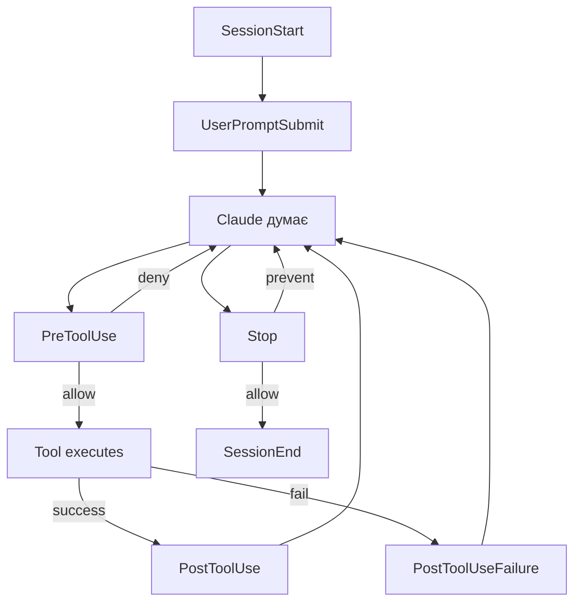

# Workshop 05

## Hooks: lifecycle deep dive

<div class="text-sm opacity-60 mt-12">90 хв · 4 вправи · `exercises/` репо паралельно</div>

<!--
П'ятий воркшоп серії — про hooks. У fundamentals ми згадували, що hooks існують. Сьогодні пишемо їх з нуля: блокуємо небезпечний bash, логуємо tool calls, ін'єктимо контекст у сесію, попереджаємо про небезпечні промпти. Тримай терміналом — паралельно зі мною. Як завжди — `exercises/` поряд із слайдами.
-->

---
transition: fade-out
hideInToc: true
---

# Що ти зможеш після

<v-clicks>

- **Прочитати hook-конфіг** у `settings.json` і пояснити кожне поле
- **Написати `PreToolUse`** що блокує небезпечну bash-команду
- **Написати `PostToolUse`** що логує кожен tool-call у JSONL
- **Інжектити контекст** у `SessionStart` (cwd, branch, recent commits)
- **Перехопити запит юзера** через `UserPromptSubmit` і додати warning
- **Debug-нути** hook що не спрацював — `/hooks`, debug log, manual test

</v-clicks>

<!--
Це не теорія. Після воркшопу маєш 4 робочих hook-и у `~/.claude/settings.json` і знаєш як diagnose-ити коли щось не firing.
-->

---
hideInToc: true
---

# Як працюватимемо

<v-clicks>

- **Я веду** — слайди + live-demo з мого терміналу
- **Ти кодиш паралельно** — `git clone <repo>; cd workshops/05-hooks/exercises`
- **4 вправи** — кожна 10–15 хв, у власній підтеці
- **`solutions/`** — готові розв'язки на випадок, якщо застрягнеш
- **`handout.pdf`** — пост-воркшоп референс

</v-clicks>

<div v-click class="mt-4 p-4 bg-blue-500/10 rounded text-sm">
Передумови: Claude Code v1.x, термінал, <code>jq</code> встановлений (<code>brew install jq</code> / <code>apt-get install jq</code>)
</div>

<!--
jq потрібен для парсингу JSON у hook-скриптах. Є альтернативи (python -c, node -e), але jq — стандарт у docs Anthropic.
-->

---
layout: section
---

# Контекст

Що таке hook і чим він відрізняється від skill

---

# Hook у двох словах

<v-clicks>

- **Shell-команда** (або HTTP-endpoint, або prompt) що виконується **автоматично** у конкретний момент lifecycle
- Ти **визначаєш** її у `settings.json`
- Claude Code **викликає** її, передає JSON у stdin
- Команда **повертає** результат через exit code + stdout/stderr
- **Детермінізм:** не залежить від того, чи Claude вирішить запустити skill — спрацює завжди

</v-clicks>

<v-click>

```json
{
  "hooks": {
    "PreToolUse": [
      { "matcher": "Bash",
        "hooks": [{ "type": "command", "command": "./check.sh" }] }
    ]
  }
}
```

</v-click>

<DocRef url="https://code.claude.com/docs/en/hooks-guide" label="code.claude.com — Hooks guide" />

<!--
Ключове слово — детермінізм. Skill — Claude вирішує тригерити. Hook — спрацює гарантовано на event. Тому hook-и юзають для policy enforcement.
-->

---

# Hook vs skill vs slash-command vs subagent

| Що | Тригер | Виконавець | Use case |
|---|---|---|---|
| **Skill** | description match | Claude | шаблон поведінки |
| **Slash-command** | (тепер skill) `/name` | Claude | явний виклик |
| **Hook** | **lifecycle event** | shell/Claude Code | policy, auto-format, audit |
| **Subagent** | Claude через `Task` | Claude (ізольовано) | паралельні гілки |

<v-click>

**Запам'ятай:** hook **не залежить** від Claude. Claude може хоч що думати — hook спрацює, бо подія сталася.

</v-click>

<DocRef url="https://code.claude.com/docs/en/hooks-guide" label="code.claude.com — How hooks work" />

<!--
Skill — Claude свідомо вирішує юзати. Hook — Claude Code сам викликає на event, без участі моделі. Це різниця між «детерміновано» і «недетерміновано».
-->

---

# Коли writing hook — правильна відповідь

<v-clicks>

✅ **Policy enforcement:** «ніколи не запускати `rm -rf /`», «не редагувати `.env`»
✅ **Auto-format:** prettier після кожного `Edit`/`Write`
✅ **Audit log:** кожен tool-call у JSONL
✅ **Context injection:** при кожному `SessionStart` додай git status + cwd
✅ **Notifications:** desktop notify коли Claude чекає на тебе

</v-clicks>

<v-click class="mt-3 p-3 bg-amber-500/10 rounded text-sm">

❌ **Не hook:** «навчи Claude нашому coding style» → це CLAUDE.md
❌ **Не hook:** «нагадуй використовувати Bun» → CLAUDE.md або skill
❌ **Не hook:** «згенеруй boilerplate React-компонент» → skill або slash-command

</v-click>

<!--
Hook — для речей, які ти хочеш ГАРАНТОВАНО. Якщо «бажано б» — це skill або CLAUDE.md.
-->

---
layout: section
---

# Lifecycle

Які бувають events і коли вони firing

---

# Catalogue: 9 ключових events

<v-clicks>

| Event | Коли firing | Може блокувати? |
|---|---|---|
| `SessionStart` | сесія стартує/resume | ні (контекст) |
| `UserPromptSubmit` | юзер відправив промпт | ✅ exit 2 |
| `PreToolUse` | перед tool-call | ✅ deny |
| `PostToolUse` | після успішного tool-call | ✅ block (з контекстом) |
| `Stop` | Claude закінчив відповідь | ✅ prevent stop |
| `SubagentStop` | subagent закінчив | ✅ prevent stop |
| `PreCompact` | перед compaction | ✅ block |
| `Notification` | CC надсилає notification | ні (observability) |
| `SessionEnd` | сесія завершується | ні (cleanup only) |

</v-clicks>

<DocRef url="https://code.claude.com/docs/en/hooks-guide" label="code.claude.com — Lifecycle table" />

<!--
Це 9 з ~25 events. Решта — для MCP, worktree, config-watcher. Ці 9 покривають 95% реальних use case.
-->

---

# Lifecycle flow



<v-click class="mt-2 text-sm opacity-70">

Між turn-ами: `PreCompact` → compaction → `PostCompact` (за потреби).

</v-click>

<!--
Map собі цей flow. PreToolUse — gate. PostToolUse — observe. Stop — можеш зациклити.
-->

---

# `Stop` event — обережно з циклом

<v-clicks>

- `Stop` firing **щоразу**, як Claude закінчив turn
- exit 2 = «не зупиняйся, continue»
- **Trap:** якщо завжди робиш exit 2 — нескінченний цикл

</v-clicks>

<v-click>

```bash {all|3-5}{lines:true}
#!/bin/bash
INPUT=$(cat)
if [ "$(echo "$INPUT" | jq -r '.stop_hook_active')" = "true" ]; then
  exit 0  # вже у continuation — пропусти
fi
# твоя перевірка тут...
```

</v-click>

<v-click class="mt-2 p-3 bg-amber-500/10 rounded text-sm">

`stop_hook_active: true` стоїть, коли Claude вже у retry після твого попереднього `exit 2`. Не повтори.

</v-click>

<DocRef url="https://code.claude.com/docs/en/hooks-guide" label="code.claude.com — Stop hook runs forever" />

<!--
Я особисто наступав на цей цикл. Перевіряй stop_hook_active першим рядком.
-->

---
layout: section
---

# Anatomy

Як писати hook у `settings.json`

---

# Структура `settings.json`

```json {all|2-4|5|6-12}{lines:true}
{
  "hooks": {
    "PreToolUse": [
      {
        "matcher": "Bash|Edit|Write",
        "hooks": [
          {
            "type": "command",
            "command": "/path/to/script.sh",
            "timeout": 600
          }
        ]
      }
    ]
  }
}
```

<v-clicks>

- **Рівень 1:** `hooks.<EventName>` — масив groups
- **Рівень 2:** group з `matcher` + `hooks[]`
- **Рівень 3:** конкретний handler — `type` + `command` + опційні поля

</v-clicks>

<DocRef url="https://code.claude.com/docs/en/hooks" label="code.claude.com — Settings.json schema" />

<!--
Три рівні nesting. Масив на кожному, бо кілька matcher-груп можуть жити поряд, кілька handlers — теж.
-->

---

# Handler fields

| Поле | Обов'язкове | Що робить |
|---|---|---|
| `type` | ✅ | `command` \| `http` \| `mcp_tool` \| `prompt` \| `agent` |
| `command` | ✅ для command | shell-команда |
| `timeout` | — | секунд до cancel; default 600 для command |
| `if` | — | permission-rule фільтр (e.g. `Bash(git *)`); CC v2.1.85+ |
| `statusMessage` | — | текст спінера поки firing |
| `shell` | — | `bash` (default) \| `powershell` |
| `async` | — | runs у background, не блокує |

<DocRef url="https://code.claude.com/docs/en/hooks" label="code.claude.com — Hook handler fields" />

<!--
Сьогодні юзаємо тільки command. Інші type-и пам'ятай як pointer: prompt = LLM eval, http = POST у webhook.
-->

---

# Matcher patterns

3 режими evaluation (https://code.claude.com/docs/en/hooks):

<v-clicks>

| Pattern | Як evaluating | Приклад |
|---|---|---|
| `"*"`, `""`, omitted | match all | firing щоразу |
| Лише `[A-Za-z0-9_\|]` | exact або `\|`-list | `"Bash"`, `"Edit\|Write"` |
| Інші символи | **JS regex** | `"^Notebook"`, `"mcp__memory__.*"` |

</v-clicks>

<v-click class="mt-3 p-3 bg-blue-500/10 rounded text-sm">

**Важливо:** matcher target **залежить від event**:
- Tool events → tool name (`Bash`, `Edit`, `mcp__github__.*`)
- `SessionStart` → source (`startup`, `resume`, `clear`, `compact`)
- `Notification` → type (`permission_prompt`, `auth_success`)

</v-click>

<DocRef url="https://code.claude.com/docs/en/hooks" label="code.claude.com — Matcher patterns" />

<!--
Не плутай: matcher для PreToolUse — це назва tool-а. Для SessionStart — це source. Це той самий ключ "matcher" але з різною семантикою.
-->

---

# Exit codes — найчастіша помилка

<v-clicks>

| Code | Поведінка |
|---|---|
| **0** | Дія дозволена. Stdout → debug log (або контекст для UserPromptSubmit/SessionStart) |
| **2** | **Block.** Stderr → Claude (для PreToolUse/PostToolUse) або юзеру |
| Інше (1, 3, ...) | Non-blocking error. Транскрипт показує `<hook> hook error` |

</v-clicks>

<v-click class="mt-3 p-3 bg-red-500/10 rounded text-sm">

⚠️ **Trap:** exit 1 — НЕ блокує. Більшість Unix-команд при помилці `exit 1`. Тобі треба явно `exit 2`.

</v-click>

<DocRef url="https://code.claude.com/docs/en/hooks-guide" label="code.claude.com — Hook output" />

<!--
Pin це на стіну. exit 1 у Unix = error. У Claude hooks = ігнор. Тільки exit 2 блокує. Цей трап у docs відмічений окремим warning.
-->

---

# JSON output для structured control

```json
{
  "continue": true,
  "stopReason": "shown to user if continue=false",
  "suppressOutput": false,
  "systemMessage": "warning shown to user"
}
```

<v-clicks>

**Per-event decision:**

- **PreToolUse** — `hookSpecificOutput.permissionDecision`: `allow|deny|ask|defer`
- **PostToolUse, Stop, SubagentStop, PreCompact** — top-level `decision: "block"` + `reason`
- **UserPromptSubmit** — `decision: "block"` АБО `hookSpecificOutput.additionalContext`

**Кілька hooks матчать один event** → найжорсткіше виграє: **deny > defer > ask > allow**

</v-clicks>

<DocRef url="https://code.claude.com/docs/en/hooks" label="code.claude.com — Common JSON output" />

<!--
JSON або exit 2 — НЕ ОБА. Docs прямо: "Don't mix them: Claude Code ignores JSON when you exit 2."
-->

---

# Input на stdin: PreToolUse приклад

```json {all|3-7|8-11}{lines:true}
{
  "session_id": "abc123",
  "cwd": "/Users/sarah/myproject",
  "permission_mode": "default",
  "hook_event_name": "PreToolUse",
  "tool_name": "Bash",
  "tool_use_id": "toolu_01ABC...",
  "tool_input": {
    "command": "npm test",
    "description": "run tests"
  }
}
```

<v-clicks>

- **Common fields:** `session_id`, `cwd`, `hook_event_name`
- **Event-specific:** `tool_name`, `tool_input`, `tool_use_id` (для tool events)
- Парсиш: `jq -r '.tool_input.command'` або `python -c 'import sys, json; ...'`

</v-clicks>

<DocRef url="https://code.claude.com/docs/en/hooks" label="code.claude.com — PreToolUse input" />

<!--
Ось чому потрібен jq. Усе на stdin — JSON. Якщо python — теж ок, просто більше boilerplate.
-->

---

# Hook locations і scope

| Локація | Scope | Shareable? |
|---|---|---|
| `~/.claude/settings.json` | усі проєкти | ❌ локально |
| `.claude/settings.json` | один проєкт | ✅ commit |
| `.claude/settings.local.json` | один проєкт | ❌ gitignore |
| Managed policy | організація | ✅ admin |
| Plugin `hooks/hooks.json` | коли plugin enabled | ✅ bundled |
| Skill/agent frontmatter | поки активний | ✅ |

<v-click>

**Precedence:** managed > local > project > user.

</v-click>

<DocRef url="https://code.claude.com/docs/en/hooks-guide" label="code.claude.com — Configure hook location" />

<!--
Сьогодні пишемо в `~/.claude/settings.json` (твоє особисте). У продакшні — `.claude/settings.json` з commit для команди.
-->

---
layout: section
---

# Hands-on

4 вправи. Терміналом паралельно.

---

# Маршрут 4 вправ

| № | Тека | Що робиш | Час |
|---|---|---|---|
| 1 | `01-block-dangerous-bash/` | `PreToolUse` regex проти `rm -rf /` | 12 хв |
| 2 | `02-tool-log/` | `PostToolUse` — JSONL audit log | 10 хв |
| 3 | `03-session-context/` | `SessionStart` — cwd + branch + commits | 12 хв |
| 4 | `04-prompt-warning/` | `UserPromptSubmit` — warn про «delete production» | 12 хв |

<v-click class="mt-3 text-sm opacity-70">

Кожна тека має `README.md` з кроками і `starter/` зі стартовим кодом. `solutions/` — готові розв'язки.

</v-click>

<!--
Дай хвилину на cd у exercises. Хто не встиг — пиши в чат.
-->

---

# Вправа 1 — block dangerous bash

**Мета:** `PreToolUse` hook що блокує `rm -rf /`, fork bombs, `dd of=/dev/`, etc.

```bash
cd workshops/05-hooks/exercises/01-block-dangerous-bash
cat README.md
```

<v-clicks>

**Кроки:**

1. Відкрий `starter/check-bash.sh` — там TODO
2. Прочитай stdin → витягни `tool_input.command`
3. Перевір regex: `rm -rf /`, `:(){:|:&};:`, `dd if=.* of=/dev/[sh]d`
4. На match → stderr + `exit 2`
5. Інакше → `exit 0`
6. Зареєструй у `~/.claude/settings.json`
7. Тестуй: попроси Claude `rm -rf /tmp/foo` (безпечно) і `rm -rf /` (заблоковано)

</v-clicks>

<!--
12 хв. Якщо застрягнеш на jq — у solutions/ є python-варіант. Не запускай небезпечні команди насправді — Claude буде підставляти tool_input а ми перехоплюємо ДО виконання.
-->

---

# Live walkthrough: check-bash.sh

```bash {all|3-4|6-12|14-15}{lines:true}
#!/bin/bash
# .claude/hooks/check-bash.sh — PreToolUse for Bash matcher
INPUT=$(cat)
COMMAND=$(echo "$INPUT" | jq -r '.tool_input.command')

DANGEROUS=(
  'rm[[:space:]]+-rf?[[:space:]]+/($|[[:space:]])'
  ':\(\)\s*\{[[:space:]]*:'
  'dd[[:space:]]+.*of=/dev/[sh]d'
  'chmod[[:space:]]+-R[[:space:]]+777[[:space:]]+/'
  'mkfs\.[a-z0-9]+[[:space:]]+/dev/'
)

for re in "${DANGEROUS[@]}"; do
  if echo "$COMMAND" | grep -qE "$re"; then
    echo "Blocked: command matches dangerous pattern '$re'" >&2
    exit 2
  fi
done
exit 0
```

<DocRef url="https://github.com/anthropics/claude-code/blob/main/examples/hooks/bash_command_validator_example.py" label="GitHub — Anthropic bash validator (Python)" />

<!--
Anthropic має реф-імплементацію у python — лінк внизу. Ми робимо bash для простоти. Idea однакова.
-->

---

# Реєстрація hook у settings.json

```json {all|3-13}{lines:true}
{
  "hooks": {
    "PreToolUse": [
      {
        "matcher": "Bash",
        "hooks": [
          {
            "type": "command",
            "command": "$HOME/.claude/hooks/check-bash.sh",
            "timeout": 5
          }
        ]
      }
    ]
  }
}
```

<v-clicks>

- `matcher: "Bash"` — exact match, тільки коли Claude юзає Bash tool
- `command` — абсолютний шлях. `$CLAUDE_PROJECT_DIR` для project hooks
- `timeout: 5` — bash regex швидкий, 5 сек з запасом

</v-clicks>

<v-click class="mt-2 text-sm opacity-70">

Не забудь `chmod +x ~/.claude/hooks/check-bash.sh`.

</v-click>

<DocRef url="https://code.claude.com/docs/en/hooks-guide" label="code.claude.com — Block edits example" :offset="1" />

<!--
chmod +x — найчастіший факап. Hook не firing → перевір executable bit першим.
-->

---

# Вправа 2 — log every tool call

**Мета:** `PostToolUse` що пише JSONL у `~/.claude/tool-log.jsonl`

```bash
cd ../02-tool-log
```

<v-clicks>

**Що логувати:**
- Timestamp (ISO 8601)
- `tool_name`
- `tool_input` (compact)
- `success` (з `tool_response`)
- `duration_ms`
- `cwd`

**Формат:** одна JSON-обʼєкт на рядок (JSONL) — щоб `jq` і `grep`-able.

</v-clicks>

<v-click class="mt-2 p-3 bg-blue-500/10 rounded text-sm">

**Чому JSONL:** легко append-only, кожен event самодостатній, парситься streaming.

</v-click>

<!--
10 хв. PostToolUse — після успіху. Для невдач — окремий event PostToolUseFailure, у solutions додано і його.
-->

---

# Live: tool-log JSONL

```bash {all|3-4|6-15|17}{lines:true}
#!/bin/bash
# ~/.claude/hooks/tool-log.sh — PostToolUse, no matcher (всі tools)
INPUT=$(cat)
LOG="$HOME/.claude/tool-log.jsonl"

echo "$INPUT" | jq -c '{
  ts: now | todate,
  session: .session_id,
  cwd: .cwd,
  tool: .tool_name,
  input: .tool_input,
  success: (.tool_response.success // null),
  duration_ms: (.duration_ms // null)
}' >> "$LOG"

exit 0
```

<v-click>

```json
// Запис у tool-log.jsonl
{"ts":"2026-04-26T18:30:12Z","session":"abc","cwd":"/repo","tool":"Bash",
 "input":{"command":"ls"},"success":true,"duration_ms":12}
```

</v-click>

<DocRef url="https://code.claude.com/docs/en/hooks-guide" label="code.claude.com — Log every Bash command" />

<!--
jq -c = compact (одна лінія). now | todate = ISO 8601 timestamp. Append-only — ніколи не редагуй цей файл, тільки rotate.
-->

---

# Вправа 3 — SessionStart context

**Мета:** при кожному старті сесії додати у контекст: cwd, гілка, останні 3 commit-и, кількість open todos

```bash
cd ../03-session-context
```

<v-clicks>

**Що генерує hook (текст у stdout):**

```
[Project context auto-loaded]
cwd: /home/dev/myproject
branch: feature/hooks (ahead 2)
recent commits:
  3136432 Add opusplan slide
  4845898 Add CI/CD section
  19a3d61 Add /recap slide
open todos: 3
```

- **stdout text → context** (для `SessionStart`, `UserPromptSubmit` — спеціальна семантика)
- Або JSON `hookSpecificOutput.additionalContext`

</v-clicks>

<DocRef url="https://code.claude.com/docs/en/hooks-guide" label="code.claude.com — Re-inject context after compaction" />

<!--
12 хв. Це найкорисніший hook у щоденній роботі. Я цей hook юзаю і кажу — мабуть найбільший ROI з усіх.
-->

---

# Live: session-context.sh

```bash {all|4-6|8-11|13-14}{lines:true}
#!/bin/bash
# ~/.claude/hooks/session-context.sh — SessionStart, no matcher
# (firing і на startup, і на resume, і на compact)
INPUT=$(cat)
CWD=$(echo "$INPUT" | jq -r '.cwd')
cd "$CWD" 2>/dev/null || exit 0

if ! git rev-parse --git-dir >/dev/null 2>&1; then
  echo "[Session] cwd: $CWD (not a git repo)"
  exit 0
fi

BRANCH=$(git branch --show-current)
COMMITS=$(git log --oneline -3 2>/dev/null | sed 's/^/  /')

echo "[Project context]"
echo "cwd: $CWD"
echo "branch: $BRANCH"
echo "recent commits:"
echo "$COMMITS"
exit 0
```

<v-click class="mt-2 text-sm opacity-70">

Точне `matcher: "compact"` — тільки після compaction (re-inject lost context).
Без matcher — щоразу.

</v-click>

<!--
Якщо хочеш повніше — солюшн додає кількість TODO у CLAUDE.md, npm version, активні git stash. Ідея та сама.
-->

---

# Вправа 4 — prompt warning

**Мета:** `UserPromptSubmit` ловить «sensitive» фрази і додає warning у контекст.

```bash
cd ../04-prompt-warning
```

<v-clicks>

**Trigger phrases (case-insensitive):**
- `delete production`, `drop production`, `truncate production`
- `force push to main`, `force push to master`
- `disable safety`, `bypass review`

**Що робить hook:**
- Знайшов збіг → JSON: `hookSpecificOutput.additionalContext` = warning
- Не знайшов → exit 0, нічого не додає

</v-clicks>

<v-click class="mt-2 p-3 bg-amber-500/10 rounded text-sm">

**Soft warn vs hard block:** ми робимо warn (Claude бачить попередження). Якщо хочеш block — `decision: "block"` + `reason`.

</v-click>

<DocRef url="https://code.claude.com/docs/en/hooks" label="code.claude.com — UserPromptSubmit" />

<!--
12 хв. Це не silver bullet — phrase-detection обходиться. Але як перший рубіж — ловить 80% помилок типу "ти забув що ми у production-репо".
-->

---

# Live: prompt-warning.sh

```bash {all|4-5|7-15|17-26}{lines:true}
#!/bin/bash
# ~/.claude/hooks/prompt-warning.sh — UserPromptSubmit (no matcher)
INPUT=$(cat)
PROMPT=$(echo "$INPUT" | jq -r '.prompt')

PATTERNS=(
  'delete production'
  'drop production'
  'force push.*(main|master)'
  'disable safety'
  'bypass review'
)

WARNED=""
for re in "${PATTERNS[@]}"; do
  if echo "$PROMPT" | grep -qiE "$re"; then
    WARNED+="• matched: '$re'\n"
  fi
done

if [ -n "$WARNED" ]; then
  jq -n --arg ctx "⚠️ Sensitive phrase detected:\n$WARNED\nProceed only with explicit confirmation." '{
    hookSpecificOutput: {
      hookEventName: "UserPromptSubmit",
      additionalContext: $ctx
    }
  }'
fi
exit 0
```

<!--
Ключове: ми exit 0 з JSON — не block. Claude отримає попередження як system-reminder перед обробкою промпту. Якщо хочеш hard block: decision: block + reason + exit 0.
-->

---

# Hard block варіант (для довідки)

```bash
# Замість JSON з additionalContext:
echo "Refusing: production-destructive phrase detected" >&2
exit 2
```

<v-clicks>

**Семантика exit 2 для UserPromptSubmit:**

- Промпт **erased** з контексту (Claude його не побачить)
- Stderr показано юзеру як reason
- Юзер мусить переписати

**Коли який варіант:**
- Soft warn (наш приклад) → освіта, не злить юзера
- Hard block → коли promptly слово = guaranteed mistake

</v-clicks>

<DocRef url="https://code.claude.com/docs/en/hooks" label="code.claude.com — UserPromptSubmit exit codes" />

<!--
В команді треба домовитись: warn чи block. Block агресивніше — юзери дратуються. Warn часто достатньо.
-->

---
layout: section
---

# Debug

Hook не firing або firing не так. Що першим перевірити.

---

# `/hooks` — read-only browser

<v-clicks>

```text
> /hooks
```

- Список усіх events
- Поряд — кількість configured hooks
- Drill-in: matcher, command, source (User/Project/Local/Plugin/Built-in)
- **Read-only** — редагуєш JSON напряму

</v-clicks>

<v-click class="mt-3 p-3 bg-blue-500/10 rounded text-sm">

**Перше — це сюди.** Якщо твій hook **не у списку** → settings.json не валідний (trailing comma, неправильний event name) або файл не там.

</v-click>

<DocRef url="https://code.claude.com/docs/en/hooks-guide" label="code.claude.com — /hooks menu" />

<!--
/hooks не запускає, не змінює — тільки показує. Це твій first-line диагностики.
-->

---

# Manual test: pipe sample JSON

```bash
echo '{
  "tool_name": "Bash",
  "tool_input": {"command": "rm -rf /"}
}' | ~/.claude/hooks/check-bash.sh

echo "Exit: $?"
```

<v-clicks>

**Що дивитись:**

- Stdout — що пішло б у Claude
- Stderr — що показалося б як reason
- `$?` — exit code (0 / 2 / інше)

**Поширені помилки:**

- `command not found` → `chmod +x` не зроблений
- `jq: command not found` → встанови `jq` або використай `python`
- `parse error` → твій shell-profile echo-ить щось при starting

</v-clicks>

<DocRef url="https://code.claude.com/docs/en/hooks-guide" label="code.claude.com — Hook error in output" />

<!--
Manual test з sample JSON — швидше ніж drink-кави і чекати поки Claude вибере той самий tool. 30-секундний reproduction.
-->

---

# JSON validation failed — subtle one

**Симптом:** Claude каже «failed to parse hook JSON» хоча твій hook валідний.

<v-clicks>

**Причина:** твій `~/.zshrc` чи `~/.bashrc` робить `echo` при старті. Hook spawn-ить shell, profile firing, output prepend-иться до JSON:

```text
Shell ready on arm64
{"decision": "block", "reason": "..."}   ← вже невалідний JSON
```

**Fix:** wrap profile-output у interactive-only check:

```bash
# у ~/.zshrc / ~/.bashrc:
if [[ $- == *i* ]]; then
  echo "Shell ready"
fi
```

`$-` містить shell flags; `i` = interactive. Hooks runs у non-interactive shell → echo пропускається.

</v-clicks>

<DocRef url="https://code.claude.com/docs/en/hooks-guide" label="code.claude.com — JSON validation failed" />

<!--
Я наступав на цей трап. Особливо коли у zshrc є `pyenv init` чи `nvm.sh` що echo-ять. Найкоротший fix — `[[ $- == *i* ]]`.
-->

---

# Debug log

```bash
# при старті:
claude --debug-file /tmp/claude.log

# в іншому терміналі:
tail -f /tmp/claude.log
```

<v-clicks>

- Кожен fired hook — рядок з: name, matcher, exit code, stdout, stderr
- Mid-session: `/debug` enable + path

**Транскрипт view (`Ctrl+O`):**
- success — silent
- exit 2 — стерр показаний як block reason
- інше non-zero — `<hook> hook error` notice + перший рядок stderr

</v-clicks>

<DocRef url="https://code.claude.com/docs/en/hooks-guide" label="code.claude.com — Debug techniques" />

<!--
Debug log = source of truth. /hooks показує конфіг; debug log показує що реально відбулось.
-->

---
layout: section
---

# Security

Hooks = arbitrary shell. Trust boundary.

---

# Trust model

<v-clicks>

- Hook **виконується** з твоїми permissions і env
- Може **читати** твій `~/.ssh/`, `~/.aws/credentials`, network
- Може **писати** будь-куди, де у тебе write access
- **Equivalent:** `curl https://random | bash`

</v-clicks>

<v-click class="mt-3 p-3 bg-red-500/10 rounded text-sm">

**Ніколи не встановлюй hook з джерела, якому не довіряєш.** Це включає:

- Plugins з random GitHub
- Snippets з Discord/Slack
- AI-generated configs без перегляду

</v-click>

<DocRef url="https://code.claude.com/docs/en/hooks" label="code.claude.com — Key Security Notes" />

<!--
Hook = повна execution. Plugin що містить hook — повна execution. Ставтеся серйозно: review JSON + scripts перед install.
-->

---

# Чому hooks все ж потрібні для security

<v-clicks>

**`PreToolUse` deny — спрацьовує навіть у `bypassPermissions`:**

> "PreToolUse hooks fire before any permission-mode check. A hook that returns `permissionDecision: 'deny'` blocks the tool even in `bypassPermissions` mode or with `--dangerously-skip-permissions`."
> — code.claude.com/docs/en/hooks-guide

</v-clicks>

<v-click>

**Це означає:** твій security-hook **гарантовано** firing, навіть коли юзер запустив CC з `--dangerously-skip-permissions`.

</v-click>

<v-click class="mt-3 p-3 bg-emerald-500/10 rounded text-sm">

Тобто: hooks — єдиний механізм policy enforcement, який **юзер не може bypass-нути** через permission-mode toggle.

</v-click>

<DocRef url="https://code.claude.com/docs/en/hooks-guide" label="code.claude.com — Hooks and permission modes" />

<!--
Це кардинально важливо для команд з compliance вимогами. Permission-modes — soft. Hook deny — hard.
-->

---

# `disableAllHooks` і managed settings

```json
{
  "disableAllHooks": true
}
```

<v-clicks>

- Глобально вимикає **усі** твої hooks (зручно для debug)
- **Не** вимикає managed hooks (admin-set)

**Managed-only mode:**

```json
{
  "allowManagedHooksOnly": true
}
```

- Лише managed + force-enabled plugin hooks
- User/project hooks ігноруються
- Для enterprise-середовищ

</v-clicks>

<DocRef url="https://code.claude.com/docs/en/hooks" label="code.claude.com — Configuration management" />

<!--
disableAllHooks — твій kill-switch коли hook щось зламав. allowManagedHooksOnly — для compliance: org-controlled hooks only.
-->

---
layout: section
---

# Production

---

# Чек-ліст перед commit

<v-clicks>

- [ ] **`chmod +x`** на всі скрипти у `.claude/hooks/`
- [ ] **`$CLAUDE_PROJECT_DIR`** замість `$HOME` для project hooks
- [ ] **`timeout`** виставлений (default 600s — забагато для більшості)
- [ ] **Manual test** через pipe sample JSON
- [ ] **Exit 2** там де треба block; exit 0 + JSON для structured
- [ ] **Stop-hook** перевіряє `stop_hook_active`
- [ ] **Profile-safe** — `~/.zshrc` не echo-ить
- [ ] **`/hooks`** показує hook у списку
- [ ] **README** у `.claude/hooks/` що робить кожен скрипт
- [ ] **CI test** — invoke hook на sample fixture

</v-clicks>

<!--
Останній пункт — CI. Якщо ваш repo шарить hooks через .claude/settings.json — додайте у CI fixture-test що hook поводиться як треба.
-->

---

# Distribution: 3 шляхи

| Спосіб | Локація | Кому |
|---|---|---|
| **Project** | `.claude/settings.json` (commit) | команді |
| **Personal** | `~/.claude/settings.json` | тільки тобі |
| **Plugin** | `<plugin>/hooks/hooks.json` + marketplace | усім |

<v-clicks>

- **Project** — компанійський coding-style enforcement, audit log, deploy gates
- **Personal** — твоя терміналка з notify-send, твій audit log
- **Plugin** — open-source security policies, наприклад «no-secrets-in-edits»

</v-clicks>

<DocRef url="https://code.claude.com/docs/en/plugins" label="code.claude.com — Plugins" />

<!--
Plugin — наступний воркшоп серії (06). Сьогодні зосереджені на personal/project.
-->

---
layout: end
hideInToc: true
---

# Resources

<div class="grid grid-cols-2 gap-4 mt-8 text-left">

<div>

**Docs**
- [code.claude.com/docs/en/hooks](https://code.claude.com/docs/en/hooks)
- [code.claude.com/docs/en/hooks-guide](https://code.claude.com/docs/en/hooks-guide)
- [Anthropic bash validator example](https://github.com/anthropics/claude-code/blob/main/examples/hooks/bash_command_validator_example.py)

</div>

<div>

**Цей воркшоп**
- `exercises/` — 4 вправи
- `solutions/` — готові розв'язки
- `handout.pdf` — повний референс
- Plan: workshop 06 = plugins

</div>

</div>

<div class="mt-12 text-sm opacity-60">
Питання? Discord / GitHub Issues / напряму
</div>

<!--
Наступний воркшоп — 06-plugins, де ці hooks та skills пакуємо у плагін, який можна шейрити. Дякую!
-->
