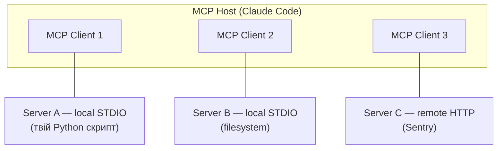
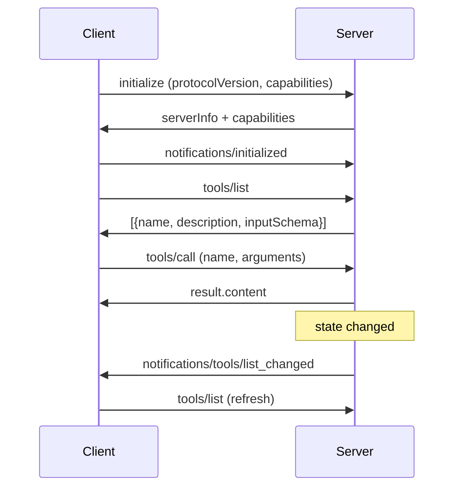

# Workshop 07

## MCP-сервери: будуємо свій на Python

<div class="text-sm opacity-60 mt-12">90 хв · 4 вправи · Python SDK · STDIO + HTTP</div>

<!--
Привіт. Сьомий воркшоп серії — MCP сервери. У fundamentals ми підключали чужі MCP-и (Sentry, GitHub). Сьогодні пишемо свій з нуля на Python SDK. 4 вправи: hello-tool, resource, prompt, підключення до Claude Code. Бери термінал.
-->

---
transition: fade-out
hideInToc: true
---

# Що ти зможеш після

<v-clicks>

- **Написати STDIO-сервер** з tool/resource/prompt через FastMCP за 30 рядків
- **Підключити до Claude Code** через `claude mcp add` або `.mcp.json`
- **Вибрати транспорт** — STDIO для локального, Streamable HTTP для remote
- **Налаштувати auth** — env-vars для stdio, Bearer/OAuth для HTTP
- **Дебажити в MCP Inspector** замість здогадок про чорну скриньку

</v-clicks>

<!--
Не теорія — твій робочий MCP-сервер на 4 вправах, підключений до Claude Code, протестований у Inspector. handout.pdf пост-воркшоп референс.
-->

---
hideInToc: true
---

# Як працюватимемо

<v-clicks>

- **Я веду** — слайди + `live-demo` зі свого терміналу
- **Ти кодиш паралельно** — `git clone <repo>; cd workshops/07-mcp-servers/exercises`
- **4 вправи** — кожна 10–20 хв, у власній підтеці
- **`solutions/`** — готові розв'язки на випадок, якщо застрягнеш
- **`handout.pdf`** — пост-воркшоп референс, ввечері передивишся

</v-clicks>

<div v-click class="mt-4 p-4 bg-blue-500/10 rounded text-sm">
Передумови: Claude Code v1.x, Python <code>3.10+</code>, <code>uv</code>, Node.js (для Inspector через <code>npx</code>)
</div>

<!--
Дай хвилину на клон і setup uv. Хто не встиг — пиши в чат.
-->

---
layout: section
---

# Контекст

Що таке MCP і навіщо тобі писати свій сервер

---

# MCP у двох словах

<v-clicks>

- **Model Context Protocol** — open-source протокол, як AI-додаток (host) бачить твої дані/тули
- **Client–server**, JSON-RPC 2.0 поверх транспорту (STDIO або HTTP)
- **Сервер експонує 3 примітиви:** tools (дії), resources (контекст), prompts (шаблони)
- **Host** (Claude Code/Desktop/VS Code) запускає **client** на кожен сервер
- Stateful: lifecycle з handshake + capability negotiation

</v-clicks>

<DocRef url="https://modelcontextprotocol.io/docs/concepts/architecture" label="modelcontextprotocol.io — Architecture" />

<!--
MCP — як USB для LLM. Уніфікований інтерфейс між host-додатком і твоїми тулами. Якщо додав адаптер раз — всі MCP-host-и одразу бачать.
-->

---

# Учасники: host, client, server



<v-clicks>

- **Host** — Claude Code. Створює по одному client-у на кожен сервер
- **Client** — компонент усередині host, тримає одне з'єднання
- **Server** — твоя програма. Local (STDIO) — субпроцес host-а. Remote (HTTP) — сервер на іншій машині

</v-clicks>

<DocRef url="https://modelcontextprotocol.io/docs/concepts/architecture#participants" label="modelcontextprotocol.io — Participants" />

<!--
Ключове: «server» — це **роль**, а не місце розгортання. Stdio-сервер усе одно сервер, хоч і живе у subprocess host-а.
-->

---

# Два рівні: data + transport

| Рівень | Що | Як |
|---|---|---|
| **Data layer** | JSON-RPC 2.0; lifecycle, primitives, notifications | Однаковий для всіх транспортів |
| **Transport layer** | STDIO або Streamable HTTP | Framing, з'єднання, auth |

<v-clicks>

- **Data layer стабільний** — той самий JSON летить через STDIO і HTTP
- **Transport обираєш** під сценарій: local subprocess чи remote сервіс
- **SDK абстрагує обидва** — пишеш бізнес-логіку, framework робить решту

</v-clicks>

<DocRef url="https://modelcontextprotocol.io/docs/concepts/architecture#layers" label="modelcontextprotocol.io — Layers" />

<!--
Це чому SDK так простий: ти пишеш функції, бібліотека сама серіалізує у JSON-RPC і шле через обраний транспорт.
-->

---

# Три примітиви сервера

| Примітив | Що | Хто викликає | Приклад |
|---|---|---|---|
| **Tools** | Функції з side-effects, дії | Модель (з апруву юзера) | `query_db`, `send_email` |
| **Resources** | Дані, read-only context | Зазвичай юзер/host обирає | `file://logs/today.log` |
| **Prompts** | Шаблони взаємодії | Юзер через `/`-меню | `/server:code-review` |

<v-clicks>

- **Tools** — модель сама вирішує коли викликати. Як function-calling
- **Resources** — host підтягує у контекст. Юзер обирає, які
- **Prompts** — параметризовані шаблони. Стають slash-командами в Claude Code

</v-clicks>

<DocRef url="https://modelcontextprotocol.io/docs/concepts/architecture#primitives" label="modelcontextprotocol.io — Primitives" />

<!--
99% серверів роблять тільки tools. Resources корисні коли є купа однотипних об'єктів (issue, file, row). Prompts — щоб юзер не переписував той самий промпт.
-->

---

# Lifecycle: handshake → discovery → use



<v-clicks>

- **Capability negotiation** — обидві сторони кажуть, які примітиви підтримують
- **Discovery** — `tools/list` повертає схеми. Host реєструє у LLM
- **Notifications** — сервер може push-ити `list_changed` без запиту

</v-clicks>

<DocRef url="https://modelcontextprotocol.io/docs/concepts/architecture#example" label="modelcontextprotocol.io — Lifecycle example" />

<!--
SDK сам робить весь lifecycle. Тобі лиш декорувати функції. Але корисно бачити, що під капотом — JSON-RPC, не магія.
-->

---
layout: section
---

# Setup

Python SDK + uv + перший hello-world

---

# Передумови

<v-clicks>

- **Python 3.10+** (SDK 1.2.0+ потребує)
- **uv** — швидкий менеджер залежностей від Astral
- **Node.js 18+** — для MCP Inspector (запускається через `npx`)

```bash
# uv (один раз)
curl -LsSf https://astral.sh/uv/install.sh | sh

# перевірка
python --version    # 3.10+
uv --version
node --version
```

</v-clicks>

<DocRef url="https://modelcontextprotocol.io/docs/develop/build-server" label="modelcontextprotocol.io — Build server (Python)" />

<!--
uv не обов'язковий — можна звичайний venv + pip. Але офіційний tutorial на uv, тримаємо темп.
-->

---

# Створюємо проєкт

```bash {all|1-2|4-5|7-8|10-11}{lines:true}
uv init mcp-hello
cd mcp-hello

uv venv
source .venv/bin/activate

uv add "mcp[cli]"

touch server.py
```

<v-clicks>

- **`uv init`** — `pyproject.toml` + git
- **`uv venv` + activate** — ізольоване env у `.venv/`
- **`mcp[cli]`** — SDK + CLI-утиліти (`mcp dev`, `mcp install`)
- **`server.py`** — наш entry-point

</v-clicks>

<DocRef url="https://github.com/modelcontextprotocol/python-sdk" label="github — python-sdk README" />

<!--
`mcp[cli]` дає `mcp dev server.py` для швидкого запуску в Inspector. Без `[cli]` тільки бібліотека.
-->

---

# Перший сервер: 9 рядків

```python {all|1|3|5-7|9-10}{lines:true}
from mcp.server.fastmcp import FastMCP

mcp = FastMCP("hello")

@mcp.tool()
def add(a: int, b: int) -> int:
    """Add two numbers"""
    return a + b

if __name__ == "__main__":
    mcp.run(transport="stdio")
```

<v-clicks>

- **`FastMCP("hello")`** — назва сервера, видно у `tools/list`
- **`@mcp.tool()`** — декоратор перетворює функцію на MCP-tool
- **Type hints** → JSON Schema для `inputSchema`
- **Docstring** → опис tool-у для моделі
- **`mcp.run(transport="stdio")`** — запуск STDIO-loop

</v-clicks>

<DocRef url="https://modelcontextprotocol.io/docs/develop/build-server" label="modelcontextprotocol.io — Building your server" />

<!--
9 рядків — повноцінний MCP-сервер. Type hints і docstring — це не косметика, це JSON Schema, яку бачить LLM.
-->

---

# FastMCP: декоратори

```python
@mcp.tool()                           # дія, side-effects
def deploy(env: str) -> str: ...

@mcp.resource("file://logs/{date}")   # дані, URI template
def get_log(date: str) -> str: ...

@mcp.prompt(title="Code Review")      # шаблон
def review_code(code: str) -> str: ...
```

<v-clicks>

- **Tool** — функція. Тип параметрів → schema. Return → `content`
- **Resource** — URI з placeholders. Параметри функції бінд-яться з URI
- **Prompt** — повертає string або список messages
- **Async ok**: `async def get_alerts(state: str) -> str:` — FastMCP підтримує

</v-clicks>

<DocRef url="https://github.com/modelcontextprotocol/python-sdk" label="github — Decorators" />

<!--
Resource URI template — як Flask/Express роутер. `file://logs/{date}` означає сервер обробить будь-який URI типу `file://logs/2026-04-26`.
-->

---

# Запуск STDIO-сервера

```bash
# Прямий запуск (для тестів):
python server.py

# Через uv (recommended):
uv run server.py

# З MCP Inspector (debug UI):
npx @modelcontextprotocol/inspector \
  uv --directory $(pwd) run server.py
```

<v-clicks>

- **STDIO loop** — сервер слухає stdin, відповідає у stdout
- **stdout заборонено** для логів — зламає JSON-RPC framing
- **logging → stderr** (default) — це OK
- **Inspector** — окрема веб-морда для debug, на наступних слайдах

</v-clicks>

<DocRef url="https://modelcontextprotocol.io/docs/develop/build-server" label="modelcontextprotocol.io — Running the server" />

<!--
`mcp.run` повертається коли host закриває stdin. У звичайному використанні — субпроцес живе скільки сесія Claude Code.
-->

---

# ⚠️ stdout = смерть STDIO-сервера

```python {all|3-4|6-7|9-10}{lines:true}
import sys
import logging

# ❌ ламає сервер
print("processing request")

# ✅ stderr — безпечно
print("processing request", file=sys.stderr)

# ✅ logging defaults to stderr
logging.info("processing request")
```

<v-clicks>

- **STDIO server framing** — кожне повідомлення JSON-RPC у stdout як рядок
- **Чужий `print`** — додасть зайве в потік, host не зможе розпарсити
- **Інструмент:** `logging` модуль, `print(..., file=sys.stderr)`, або файл
- **HTTP-сервер** — будь-який stdout OK, не використовується для protocol

</v-clicks>

<DocRef url="https://modelcontextprotocol.io/docs/develop/build-server#logging-in-mcp-servers" label="modelcontextprotocol.io — Logging" />

<!--
Цей факап — №1 при першому сервері. `print("debug")` десь у коді — і Claude Code не може підключитися. Дивись stderr щоб побачити чому.
-->

---
layout: section
---

# Hands-on

4 вправи. Терміналом паралельно.

---

# Вправа 1 — hello-world tool

**Мета:** STDIO-сервер з одним tool — повертає поточний час.

```bash
cd workshops/07-mcp-servers/exercises/01-hello-tool
cat README.md
```

<v-clicks>

**Кроки:**
1. `uv venv && source .venv/bin/activate`
2. `uv add "mcp[cli]"`
3. Скопіюй `starter/server.py` — вже має skeleton з `FastMCP("clock")`
4. Додай `@mcp.tool()` `current_time(tz: str = "UTC") -> str`
5. Запусти в Inspector: `npx @modelcontextprotocol/inspector uv run server.py`
6. У вкладці **Tools** — виклич `current_time`, перевір result

</v-clicks>

<v-click class="mt-2 text-sm opacity-70">

Час: 15 хв. `solutions/01-hello-tool/` — готове.

</v-click>

<!--
Inspector — критично важливий tool, без нього debug як гадання на кофейній гущі. 15 хв.
-->

---

# Live: tool з timezone

```python {all|1-3|5-7|9-15}{lines:true}
from datetime import datetime
from zoneinfo import ZoneInfo
from mcp.server.fastmcp import FastMCP

mcp = FastMCP("clock")

@mcp.tool()
def current_time(tz: str = "UTC") -> str:
    """Return current time in the given IANA timezone (e.g. Europe/Kyiv).

    Args:
        tz: IANA timezone string. Default UTC.
    """
    return datetime.now(ZoneInfo(tz)).isoformat()

if __name__ == "__main__":
    mcp.run(transport="stdio")
```

<v-clicks>

- Docstring і `Args:` секція потрапляють у `inputSchema.description`
- Type hint `str = "UTC"` робить параметр **optional** з default
- Return `str` — content type автоматично `text`

</v-clicks>

<!--
Зверни увагу на Args: у docstring — FastMCP парсить це як description полів. Потужний crossover Python <-> JSON Schema.
-->

---

# MCP Inspector у дії

```bash
npx @modelcontextprotocol/inspector \
  uv --directory $(pwd) run server.py
```

<v-clicks>

- **Server connection pane** — обираєш транспорт, args, env
- **Tools tab** — список tools, схеми, форма для виклику, результат
- **Resources tab** — список resources, content, MIME
- **Prompts tab** — шаблони, тестування з аргументами
- **Notifications pane** — stderr-логи + JSON-RPC notifications

</v-clicks>

<v-click class="mt-3 p-3 bg-blue-500/10 rounded text-sm">

**Це твій REPL для MCP-сервера.** Поки сервер пишеш — Inspector відкритий. Без перезапусків.

</v-click>

<DocRef url="https://modelcontextprotocol.io/docs/tools/inspector" label="modelcontextprotocol.io — Inspector" />

<!--
Inspector сам перезапускає сервер після зміни коду — гаряче не як у webpack, але швидко. Тримай вкладку відкритою всю вправу.
-->

---

# Вправа 2 — додаємо resource

**Мета:** сервер експонує файл `notes.md` як MCP-resource.

```bash
cd ../02-add-resource
ls starter/
# server.py  notes.md
```

<v-clicks>

**Кроки:**
1. Відкрий `starter/server.py` (вже з tool з вправи 1)
2. Додай:
   ```python
   @mcp.resource("file://notes")
   def get_notes() -> str:
       """Project notes."""
       return open("notes.md").read()
   ```
3. Перезавантаж Inspector → вкладка **Resources** → побач `file://notes`
4. Клік → побач content
5. **Bonus:** додай URI template `file://notes/{section}` що повертає секцію

</v-clicks>

<!--
URI scheme `file://` — convention. Можеш `notes://`, `git://`, що завгодно. Це адресація, не магія.
-->

---

# Resources: статичні vs templated

```python {all|1-3|5-7}{lines:true}
@mcp.resource("config://app")
def app_config() -> str:
    return open("config.toml").read()

@mcp.resource("file://docs/{name}")
def get_doc(name: str) -> str:
    return open(f"docs/{name}.md").read()
```

<v-clicks>

- **Static** — фіксований URI, безпараметрова функція. З'являється у `resources/list`
- **Templated** — `{placeholder}` бінд до параметра. Не у `resources/list` (бо бесконечно багато), але client може звернутися за конкретним URI
- **Return type:** string → text/plain. Бінарне — `bytes`. Складне — list of `Resource` з MIME

</v-clicks>

<DocRef url="https://github.com/modelcontextprotocol/python-sdk" label="github — Resources" />

<!--
Static показуються у списку. Templated — це як параметризовані ендпоінти. Юзер має знати конкретний URI щоб запросити.
-->

---

# Вправа 3 — додаємо prompt

**Мета:** prompt template `summarize_notes` з аргументом `style`.

```bash
cd ../03-add-prompt
```

<v-clicks>

**Кроки:**
1. У `server.py` додай:
   ```python
   @mcp.prompt(title="Summarize notes")
   def summarize_notes(style: str = "bullet") -> str:
       notes = open("notes.md").read()
       return (
         f"Summarize the following notes in {style} style:\n\n{notes}"
       )
   ```
2. Inspector → **Prompts** tab → побач `summarize_notes`
3. Тестуй з `style="paragraph"` — перевір згенероване повідомлення
4. **Bonus:** поверни список messages (system + user) замість string

</v-clicks>

<DocRef url="https://github.com/modelcontextprotocol/python-sdk" label="github — Prompts" />

<!--
Prompt стане slash-командою у Claude Code: `/server-name:summarize_notes`. Аргументи — autocomplete-підказки.
-->

---

# Prompts: повертати string чи messages

```python {all|1-4|6-13}{lines:true}
# Простий: string повертається як user message
@mcp.prompt()
def review_code(code: str) -> str:
    return f"Please review this code:\n\n{code}"

# Складний: список messages з ролями
from mcp.server.fastmcp.prompts import base

@mcp.prompt()
def debug_session(error: str) -> list[base.Message]:
    return [
        base.UserMessage("I'm seeing this error:"),
        base.UserMessage(error),
        base.AssistantMessage("Let me trace it. First check..."),
    ]
```

<v-clicks>

- **String** — швидко, single user-turn
- **`list[Message]`** — повний контроль: system, user, assistant, tool
- **Title у декораторі** — людська назва у UI (`@mcp.prompt(title="...")`)

</v-clicks>

<DocRef url="https://github.com/modelcontextprotocol/python-sdk" label="github — Prompt messages" />

<!--
Список messages дає тобі few-shot — підкласти приклади до того, як юзер заговорить.
-->

---
layout: section
---

# Транспорти

STDIO vs Streamable HTTP

---

# STDIO: коли і чому

<v-clicks>

- **Дефолт** для локальних серверів
- **Один client** на сервер. Запускається як subprocess host-а
- **Без мережі** — оптимально швидко, без auth-overhead
- **Секрети** — через env-vars при запуску
- **Use case:** твоя IDE, локальні утиліти (git, fs, db proxy)

```python
mcp.run(transport="stdio")  # default
```

</v-clicks>

<v-click class="mt-3 p-3 bg-blue-500/10 rounded text-sm">

**Правило:** якщо сервер працює лише з локальними даними однієї людини → STDIO. Без вийнятків.

</v-click>

<DocRef url="https://modelcontextprotocol.io/docs/concepts/architecture#transport-layer" label="modelcontextprotocol.io — Transport layer" />

<!--
99% серверів які я писав — STDIO. HTTP лише коли треба ділитися сервером між кількома людьми.
-->

---

# Streamable HTTP: коли і як

```python {all|3}{lines:true}
if __name__ == "__main__":
    # за замовчуванням слухає http://localhost:8000/mcp
    mcp.run(transport="streamable-http")
```

<v-clicks>

- **HTTP POST** для request → response
- **Опційно SSE** для server-streaming (long ops, progress)
- **Багато клієнтів** одночасно
- **Auth** — Bearer, API keys у headers, OAuth 2.0
- **Use case:** SaaS-сервіс, командний MCP (Sentry, GitHub, Notion)

</v-clicks>

<v-click class="mt-2 text-sm opacity-70">

⚠️ SSE-only транспорт **deprecated**. Streamable HTTP його замінює.

</v-click>

<DocRef url="https://modelcontextprotocol.io/docs/concepts/architecture#transport-layer" label="modelcontextprotocol.io — Streamable HTTP" />

<!--
Якщо ти **користуєшся** чужим SSE-сервером — ще працює. Якщо **пишеш** свій — Streamable HTTP, не SSE.
-->

---

# Auth: STDIO vs HTTP

| Транспорт | Метод | Як |
|---|---|---|
| **STDIO** | Env-vars | `--env API_KEY=xxx` при `claude mcp add` |
| **HTTP** | Bearer token | `--header "Authorization: Bearer xxx"` |
| **HTTP** | API key | `--header "X-API-Key: xxx"` |
| **HTTP** | OAuth 2.0 | Сервер ініціює flow, юзер `/mcp` усередині Claude Code |

<v-clicks>

- **STDIO secrets** — у env. Сервер читає `os.environ["API_KEY"]`
- **HTTP recommended:** OAuth 2.0 (рекомендація MCP). Юзер не копіпастить токен
- **`.mcp.json`** підтримує `${VAR}` expansion — секрети залишаються поза VCS

</v-clicks>

<DocRef url="https://code.claude.com/docs/en/mcp" label="code.claude.com — MCP auth" />

<!--
OAuth найкраще для shared HTTP-серверів. Юзер ходить через `/mcp` команду у Claude Code, бачить browser-вікно для логіну, токен зберігається.
-->

---
layout: section
---

# Connect

Підключаємо до Claude Code

---

# `claude mcp add` — три варіанти

```bash {all|1-2|4-5|7-9}{lines:true}
# 1. Local stdio (твій скрипт)
claude mcp add --transport stdio mclock -- uv run server.py

# 2. Remote HTTP
claude mcp add --transport http notion https://mcp.notion.com/mcp

# 3. Remote HTTP з Bearer
claude mcp add --transport http secure https://api.example.com/mcp \
  --header "Authorization: Bearer your-token"
```

<v-clicks>

- **Опції — ДО імені**, потім `--`, потім command + args
- **Stdio:** `--` відокремлює name від `<command>`
- **HTTP:** просто URL після name
- Перевір: `claude mcp list`

</v-clicks>

<DocRef url="https://code.claude.com/docs/en/mcp#installing-mcp-servers" label="code.claude.com — Installing MCP servers" />

<!--
Помилка номер один: `claude mcp add server-name -- python script.py --transport stdio`. Транспорт ПЕРЕД ім'ям, інакше парситься як прапор для python.
-->

---

# `.mcp.json` — конфіг проєкту

```json {all|3-7|9-15}{lines:true}
{
  "mcpServers": {
    "mclock": {
      "command": "uv",
      "args": ["--directory", "/abs/path/to/server", "run", "server.py"],
      "env": {"DEBUG": "1"}
    },

    "remote-api": {
      "type": "http",
      "url": "${API_BASE_URL:-https://api.example.com}/mcp",
      "headers": {
        "Authorization": "Bearer ${API_KEY}"
      }
    }
  }
}
```

<v-clicks>

- **Лежить у root проєкту**, комітиться у git
- **Підтримує `${VAR}`** і `${VAR:-default}` для env
- При першому використанні Claude Code **запитує апрув** — security

</v-clicks>

<DocRef url="https://code.claude.com/docs/en/mcp#environment-variable-expansion-in-mcp-json" label="code.claude.com — env expansion" />

<!--
Project-scope конфіг — найкорисніший для команди. Кожен клонує репо і має той самий MCP. Секрети — через env у `.env` або CI vars.
-->

---

# Scopes: де живе конфіг

| Scope | Де | Видно команді | Файл |
|---|---|---|---|
| **`local`** (default) | Лише цей проєкт | ❌ | `~/.claude.json` |
| **`project`** | Лише цей проєкт | ✅ через VCS | `.mcp.json` у root |
| **`user`** | Усі твої проєкти | ❌ | `~/.claude.json` |

<v-clicks>

```bash
claude mcp add --scope project --transport stdio mclock -- uv run server.py
claude mcp add --scope user --transport http stripe https://mcp.stripe.com
```

**Precedence:** local > project > user > plugin > claude.ai connectors

</v-clicks>

<DocRef url="https://code.claude.com/docs/en/mcp#mcp-installation-scopes" label="code.claude.com — Scopes" />

<!--
Для воркшопу: твій сервер для всіх проєктів — `--scope user`. Команді — `--scope project`. Експерименти — default local.
-->

---

# Вправа 4 — підключаємо до Claude Code

**Мета:** твій сервер з вправ 1–3 запущений в реальній Claude Code сесії.

```bash
cd ../04-connect-claude
```

<v-clicks>

**Кроки:**
1. Скопіюй фінальний `server.py` (з tool + resource + prompt) у цю теку
2. Додай у Claude Code:
   ```bash
   claude mcp add --scope user --transport stdio my-clock \
     -- uv --directory $(pwd) run server.py
   ```
3. `claude mcp list` — побач `my-clock` у списку
4. Запусти Claude Code: `claude`
5. У сесії: `/mcp` — побач статус **connected**
6. Спитай: «Який зараз час у Києві?» — Claude мав викликати `current_time`
7. Подивися resource: `> прочитай notes` — мав потягнути `file://notes`

</v-clicks>

<!--
Якщо `/mcp` показує **failed** — `claude mcp get my-clock` покаже команду; запусти руками щоб побачити stderr.
-->

---

# Управління серверами

```bash
claude mcp list                    # усі сервери
claude mcp get my-clock            # деталі (command, args, env)
claude mcp remove my-clock         # видалити
claude mcp reset-project-choices   # скинути апруви .mcp.json

# Усередині Claude Code:
/mcp                               # статус, OAuth login для remote
/reload-plugins                    # для plugin-bundled MCP
```

<v-clicks>

- **`/mcp`** — debug центр у сесії: connected/failed, скільки tools
- **OAuth flow** — стартує тут для remote servers
- **`MAX_MCP_OUTPUT_TOKENS=50000`** — підняти ліміт виводу tool-ів (default 10K)
- **`MCP_TIMEOUT=10000`** — startup timeout у мс

</v-clicks>

<DocRef url="https://code.claude.com/docs/en/mcp" label="code.claude.com — Managing servers" />

<!--
`MAX_MCP_OUTPUT_TOKENS` доводилось піднімати кілька разів. По дефолту 10K — для logs/dump малувато.
-->

---
layout: section
---

# Debug

Сервер не працює. Що першим перевірити.

---

# 6-крокова діагностика

<v-clicks>

1. **`claude mcp list` показує?**
   - Ні → `add` не виконався, перечитай команду
   - Так → крок 2

2. **`/mcp` всередині сесії: connected?**
   - failed → крок 3
   - connected → крок 5

3. **`claude mcp get <name>`** → покаже command. Запусти руками:
   ```bash
   uv --directory /path run server.py
   ```
   Падає → бачиш stderr з помилкою

4. **stdout у коді?** Грепни:
   ```bash
   grep -n 'print(' server.py
   ```
   `print(...)` без `file=sys.stderr` — ламає STDIO

5. **Tool не викликається?** Inspector → Tools tab → виклич руками
6. **Schema крива?** Перевір type hints + docstring `Args:` секцію

</v-clicks>

<DocRef url="https://modelcontextprotocol.io/docs/tools/inspector" label="modelcontextprotocol.io — Inspector" />

<!--
90% проблем — кроки 3–4. Stdout-факап і шлях у `--directory` неправильний — основні два винуватці.
-->

---

# stderr — твій єдиний канал

```python {all|1-3|5-9}{lines:true}
import logging
import sys

logging.basicConfig(
    level=logging.INFO,
    stream=sys.stderr,
    format='%(asctime)s [%(levelname)s] %(message)s'
)
log = logging.getLogger("my-server")

@mcp.tool()
def deploy(env: str) -> str:
    log.info("deploy called: env=%s", env)
    # ...
```

<v-clicks>

- **STDIO-сервер пише ТІЛЬКИ stderr** для діагностики
- **Inspector показує stderr** у вкладці **Notifications**
- **Claude Code** — stderr підбирається у його логи, дивись `~/.claude/logs/` (за наявності)
- **HTTP-сервер** — будь-який stdout OK, не використовується для protocol

</v-clicks>

<DocRef url="https://modelcontextprotocol.io/docs/develop/build-server#logging-in-mcp-servers" label="modelcontextprotocol.io — Logging" />

<!--
Налаштуй logging ДО будь-якого `print` у проєкті. Звичка спасе час debug.
-->

---

# Reconnect і output limits

<v-clicks>

**Reconnection (HTTP/SSE):**

> "Claude Code automatically reconnects with exponential backoff: up to five attempts, starting at a one-second delay and doubling each time."

- Stdio — НЕ автоматично, бо це local subprocess. Перезапусти Claude Code
- HTTP — 5 спроб, потім marked failed → `/mcp` для retry

**Output limits:**

- **10K токенів** — ворнінг за замовчуванням
- `MAX_MCP_OUTPUT_TOKENS=50000` — підняти
- Великий вивід → tool повертає **handle/URI**, юзер питає лише потрібну частину

</v-clicks>

<DocRef url="https://code.claude.com/docs/en/mcp#automatic-reconnection" label="code.claude.com — Reconnection" />

<!--
Output limits — той момент де гарний дизайн tool-ів важливий. Не повертай 100К рядків логу — поверни URI на resource, нехай host тягне за потреби.
-->

---
layout: section
---

# Production-готовність

---

# Чек-ліст перед публікацією

<v-clicks>

- [ ] **`FastMCP("name")`** — kebab-case, унікальне у твоєму неймспейсі
- [ ] **Type hints + docstring** на кожному tool/resource/prompt
- [ ] **Args: секція** у docstring — потрапляє у JSON Schema
- [ ] **stderr-only logging** для STDIO-серверів
- [ ] **Жодного `print(...)`** без `file=sys.stderr`
- [ ] **Env-vars для секретів** (не hard-code в коді)
- [ ] **Output trimming** — tool не дампить 100K-токенний результат
- [ ] **Тестовано в Inspector** — кожен tool, resource, prompt
- [ ] **README** — як встановити, які env потрібні, приклад `.mcp.json`
- [ ] **Версіонування** через git tags якщо публічно

</v-clicks>

<!--
Один файл `server.py` достатньо для початку. Структуру з `tools/`, `resources/` робиш коли скрипт > 300 рядків.
-->

---

# Distribution: 3 шляхи

| Спосіб | Як юзер ставить | Кому | Плюси |
|---|---|---|---|
| **PyPI пакет** | `uvx my-mcp-server` | Усім | Версіонування, оновлення |
| **Git репо** | `claude mcp add ... -- uv run --from git+...` | Команді / собі | Без публікації |
| **Plugin bundle** | `/plugin install` | Marketplace | Skills + commands + MCP в одному |

<v-clicks>

```bash
# PyPI
claude mcp add --transport stdio mygit -- uvx my-git-mcp

# Git
claude mcp add --transport stdio mygit \
  -- uv run --from git+https://github.com/me/my-git-mcp my-git-mcp
```

</v-clicks>

<DocRef url="https://code.claude.com/docs/en/mcp" label="code.claude.com — Plugin-provided MCP servers" />

<!--
Plugin bundle — для workshop 06. Найзручніший спосіб поширити свій stack «skills + slash + MCP» одним пакетом.
-->

---
layout: end
hideInToc: true
---

# Resources

<div class="grid grid-cols-2 gap-4 mt-8 text-left">

<div>

**Docs**
- [modelcontextprotocol.io/docs/concepts/architecture](https://modelcontextprotocol.io/docs/concepts/architecture)
- [modelcontextprotocol.io/docs/develop/build-server](https://modelcontextprotocol.io/docs/develop/build-server)
- [github/python-sdk](https://github.com/modelcontextprotocol/python-sdk)
- [code.claude.com/docs/en/mcp](https://code.claude.com/docs/en/mcp)

</div>

<div>

**Цей воркшоп**
- `exercises/` — 4 вправи
- `solutions/` — готові розв'язки
- `handout.pdf` — повний референс
- Plan: workshop 08 = headless / CI

</div>

</div>

<div class="mt-12 text-sm opacity-60">
Питання? Discord / GitHub Issues / напряму
</div>

<!--
Наступний воркшоп — 08-headless-ci, Claude Code у пайплайнах. Дякую!
-->
